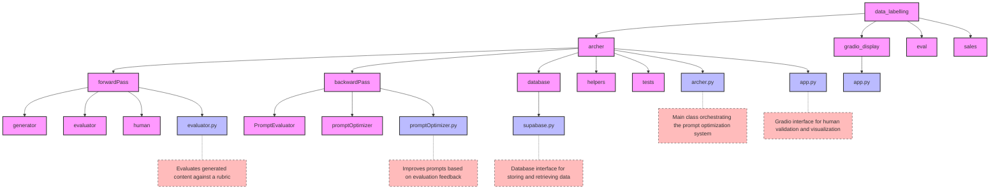

```mermaid
graph TD
    %% Main Directories
    Root[data_labelling]
    Archer[archer]
    GradioDisplay[gradio_display]
    Eval[eval]
    Sales[sales]
    
    %% Archer Subdirectories
    ForwardPass[forwardPass]
    BackwardPass[backwardPass]
    Database[database]
    Helpers[helpers]
    Tests[tests]
    
    %% Forward Pass Subdirectories
    Generator[generator]
    Evaluator[evaluator]
    Human[human]
    
    %% Backward Pass Subdirectories
    PromptEval[PromptEvaluator]
    PromptOpt[promptOptimizer]
    
    %% Directory Structure
    Root --> Archer
    Root --> GradioDisplay
    Root --> Eval
    Root --> Sales
    
    %% Archer Structure
    Archer --> ForwardPass
    Archer --> BackwardPass
    Archer --> Database
    Archer --> Helpers
    Archer --> Tests
    
    %% Forward Pass Structure
    ForwardPass --> Generator
    ForwardPass --> Evaluator
    ForwardPass --> Human
    
    %% Backward Pass Structure
    BackwardPass --> PromptEval
    BackwardPass --> PromptOpt
    
    %% Key Files
    ArcherPy[archer.py]
    AppPy[app.py]
    PromptOptimizerPy[promptOptimizer.py]
    EvaluatorPy[evaluator.py]
    ArgillaPy[supabase.py]
    
    %% File Connections
    Archer --> ArcherPy
    Archer --> AppPy
    BackwardPass --> PromptOptimizerPy
    ForwardPass --> EvaluatorPy
    Database --> ArgillaPy
    GradioDisplay --> GradioAppPy[app.py]
    
    %% File Descriptions
    ArcherPy -.- ArcherDesc["Main class orchestrating the prompt optimization system"]
    AppPy -.- AppDesc["Gradio interface for human validation and visualization"]
    PromptOptimizerPy -.- PromptOptimizerDesc["Improves prompts based on evaluation feedback"]
    EvaluatorPy -.- EvaluatorDesc["Evaluates generated content against a rubric"]
    ArgillaPy -.- ArgillaDesc["Database interface for storing and retrieving data"]
    
    %% Styling
    classDef directory fill:#f9f,stroke:#333,stroke-width:2px
    classDef file fill:#bbf,stroke:#333,stroke-width:2px
    classDef description fill:#fbb,stroke:#333,stroke-width:1px,stroke-dasharray: 5 5
    
    class Root,Archer,GradioDisplay,Eval,Sales,ForwardPass,BackwardPass,Database,Helpers,Tests,Generator,Evaluator,Human,PromptEval,PromptOpt directory
    class ArcherPy,AppPy,PromptOptimizerPy,EvaluatorPy,ArgillaPy,GradioAppPy file
    class ArcherDesc,AppDesc,PromptOptimizerDesc,EvaluatorDesc,ArgillaDesc description
``` 