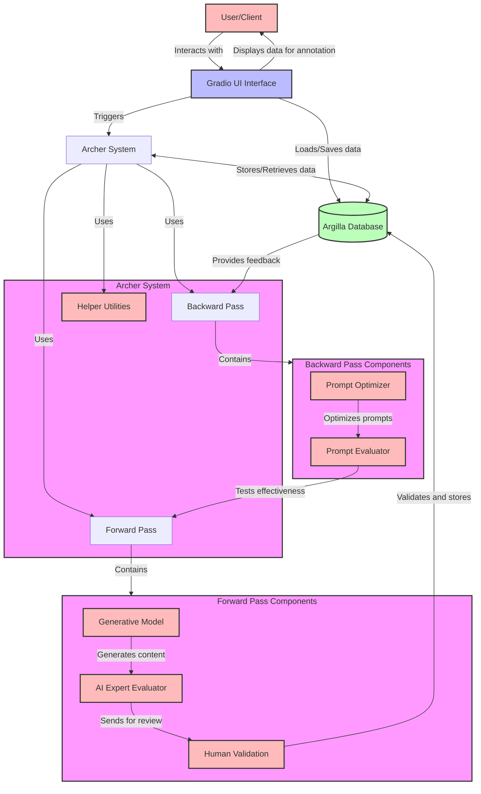

```mermaid
graph TB
    %% Main Components
    User[User/Client]
    GradioUI[Gradio UI Interface]
    Archer[Archer System]
    Database[(Argilla Database)]
    
    %% Archer Subcomponents
    subgraph ArcherSystem[Archer System]
        ForwardPass[Forward Pass]
        BackwardPass[Backward Pass]
        Helpers[Helper Utilities]
    end
    
    %% Forward Pass Components
    subgraph ForwardPassComponents[Forward Pass Components]
        Generator[Generative Model]
        Evaluator[AI Expert Evaluator]
        HumanVal[Human Validation]
    end
    
    %% Backward Pass Components
    subgraph BackwardPassComponents[Backward Pass Components]
        PromptOpt[Prompt Optimizer]
        PromptEval[Prompt Evaluator]
    end
    
    %% User Interactions
    User -->|Interacts with| GradioUI
    GradioUI -->|Displays data for annotation| User
    GradioUI -->|Loads/Saves data| Database
    GradioUI -->|Triggers| Archer
    
    %% Archer Internal Flow
    Archer -->|Uses| ForwardPass
    Archer -->|Uses| BackwardPass
    Archer -->|Uses| Helpers
    Archer <-->|Stores/Retrieves data| Database
    
    %% Forward Pass Flow
    ForwardPass -->|Contains| ForwardPassComponents
    Generator -->|Generates content| Evaluator
    Evaluator -->|Sends for review| HumanVal
    HumanVal -->|Validates and stores| Database
    
    %% Backward Pass Flow
    BackwardPass -->|Contains| BackwardPassComponents
    PromptOpt -->|Optimizes prompts| PromptEval
    PromptEval -->|Tests effectiveness| ForwardPass
    Database -->|Provides feedback| BackwardPass
    
    %% Styling
    classDef system fill:#f9f,stroke:#333,stroke-width:2px
    classDef ui fill:#bbf,stroke:#333,stroke-width:2px
    classDef data fill:#bfb,stroke:#333,stroke-width:2px
    classDef component fill:#fbb,stroke:#333,stroke-width:2px
    
    class ArcherSystem,ForwardPassComponents,BackwardPassComponents system
    class GradioUI ui
    class Database data
    class User,Generator,Evaluator,HumanVal,PromptOpt,PromptEval,Helpers component
``` 