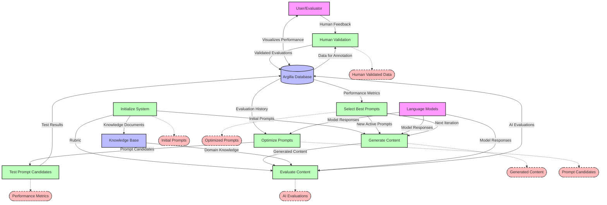

```mermaid
flowchart TB
    %% External Entities
    User[User/Evaluator]
    LLM[Language Models]
    
    %% Data Stores
    DB[(Argilla Database)]
    KB[Knowledge Base]
    
    %% Processes
    Init[Initialize System]
    Generate[Generate Content]
    Evaluate[Evaluate Content]
    HumanValidate[Human Validation]
    Optimize[Optimize Prompts]
    PromptTest[Test Prompt Candidates]
    SelectBest[Select Best Prompts]
    
    %% Data Flows
    Init -->|Initial Prompts| Generate
    Init -->|Knowledge Documents| KB
    Init -->|Rubric| Evaluate
    
    Generate -->|Generated Content| Evaluate
    KB -->|Domain Knowledge| Evaluate
    Evaluate -->|AI Evaluations| DB
    DB -->|Data for Annotation| HumanValidate
    User -->|Human Feedback| HumanValidate
    HumanValidate -->|Validated Evaluations| DB
    
    DB -->|Evaluation History| Optimize
    Optimize -->|Prompt Candidates| PromptTest
    PromptTest -->|Test Results| DB
    DB -->|Performance Metrics| SelectBest
    SelectBest -->|New Active Prompts| Generate
    
    %% External Data Flows
    User <-->|Visualizes Performance| DB
    LLM -->|Model Responses| Generate
    LLM -->|Model Responses| Evaluate
    LLM -->|Model Responses| Optimize
    
    %% Process Loop
    SelectBest -->|Next Iteration| Generate
    
    %% Data Descriptions
    InitialPrompts([Initial Prompts])
    GeneratedContent([Generated Content])
    AIEvals([AI Evaluations])
    HumanValidatedData([Human Validated Data])
    PromptCandidates([Prompt Candidates])
    PerformanceMetrics([Performance Metrics])
    OptimizedPrompts([Optimized Prompts])
    
    Init -.-> InitialPrompts
    Generate -.-> GeneratedContent
    Evaluate -.-> AIEvals
    HumanValidate -.-> HumanValidatedData
    Optimize -.-> PromptCandidates
    PromptTest -.-> PerformanceMetrics
    SelectBest -.-> OptimizedPrompts
    
    %% Styling
    classDef external fill:#f9f,stroke:#333,stroke-width:2px
    classDef storage fill:#bbf,stroke:#333,stroke-width:2px
    classDef process fill:#bfb,stroke:#333,stroke-width:2px
    classDef data fill:#fbb,stroke:#333,stroke-width:1px,stroke-dasharray: 5 5
    
    class User,LLM external
    class DB,KB storage
    class Init,Generate,Evaluate,HumanValidate,Optimize,PromptTest,SelectBest process
    class InitialPrompts,GeneratedContent,AIEvals,HumanValidatedData,PromptCandidates,PerformanceMetrics,OptimizedPrompts data
``` 