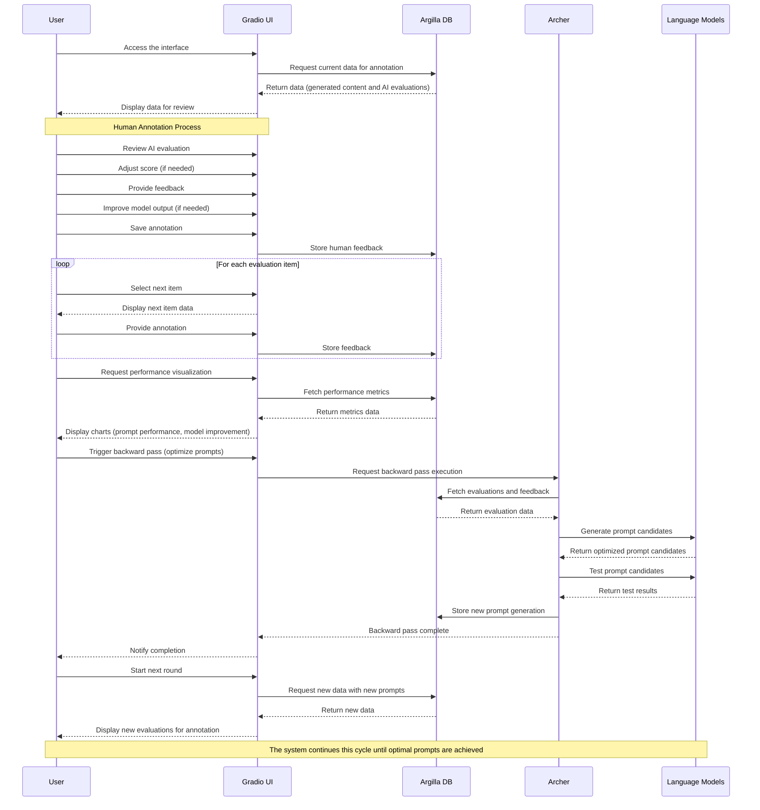

```mermaid
sequenceDiagram
    participant User
    participant GradioUI as Gradio UI
    participant Database as Argilla DB
    participant Archer
    participant LLM as Language Models
    
    %% Initial Setup
    User->>GradioUI: Access the interface
    GradioUI->>Database: Request current data for annotation
    Database-->>GradioUI: Return data (generated content and AI evaluations)
    GradioUI-->>User: Display data for review
    
    %% Human Annotation Loop
    Note over User,GradioUI: Human Annotation Process
    
    User->>GradioUI: Review AI evaluation
    User->>GradioUI: Adjust score (if needed)
    User->>GradioUI: Provide feedback
    User->>GradioUI: Improve model output (if needed)
    User->>GradioUI: Save annotation
    GradioUI->>Database: Store human feedback
    
    %% Repeat for multiple items
    loop For each evaluation item
        User->>GradioUI: Select next item
        GradioUI-->>User: Display next item data
        User->>GradioUI: Provide annotation
        GradioUI->>Database: Store feedback
    end
    
    %% Visualization and Analysis
    User->>GradioUI: Request performance visualization
    GradioUI->>Database: Fetch performance metrics
    Database-->>GradioUI: Return metrics data
    GradioUI-->>User: Display charts (prompt performance, model improvement)
    
    %% Trigger Backward Pass
    User->>GradioUI: Trigger backward pass (optimize prompts)
    GradioUI->>Archer: Request backward pass execution
    Archer->>Database: Fetch evaluations and feedback
    Database-->>Archer: Return evaluation data
    
    Archer->>LLM: Generate prompt candidates
    LLM-->>Archer: Return optimized prompt candidates
    
    Archer->>LLM: Test prompt candidates
    LLM-->>Archer: Return test results
    
    Archer->>Database: Store new prompt generation
    Archer-->>GradioUI: Backward pass complete
    GradioUI-->>User: Notify completion
    
    %% Next Round
    User->>GradioUI: Start next round
    GradioUI->>Database: Request new data with new prompts
    Database-->>GradioUI: Return new data
    GradioUI-->>User: Display new evaluations for annotation
    
    %% Process States
    Note over User,LLM: The system continues this cycle until optimal prompts are achieved
``` 